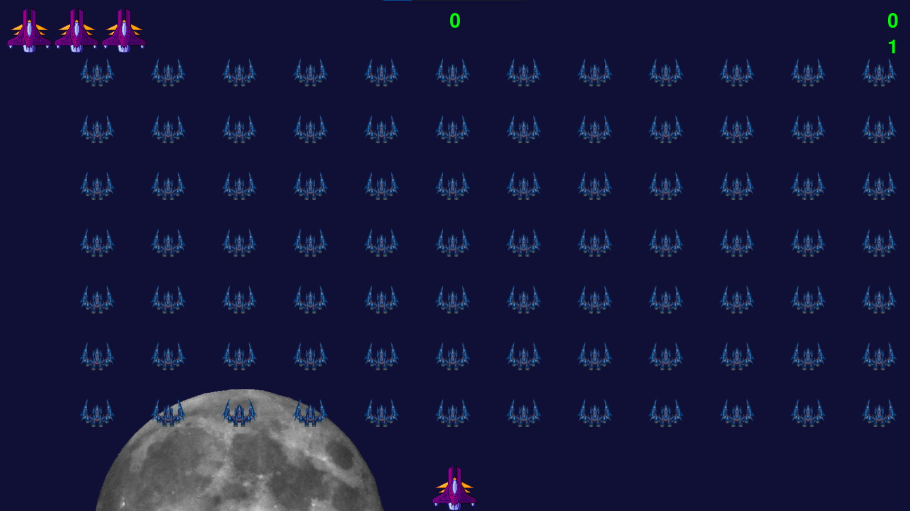

# Alien-Invasion
# [PYGAME] The invasion of Aliens

## Introduction

Here is the game from the book Python Crash Course by Eric Matthes
I also put in some of my own features for a better look at! Including the Moon, type of Alien, Ship, Background and so on...

 

## Motivation
Since I want to learn more Python, making a game with Python will make the journy more interesting. Throughout the Chapters, I can learn a lot about Python, such as refactoring your code, reviewing your project, etc.

Working with multiple functions, methods, modules will give you some expertise in programming later on your journey. This is just a 2D game, but ... everyone has to start somewhere right? So let's dive in coding, find your own fun. 

If you can do something to make this game more fun, feel free to let me know.

## How to use my code

You need to download all the files that ending with ".py". Store it in a folder, then use source code-editor to open it. Then load all the files and run THE MAIN file named "UFO_ship.py" to PLAY THE GAME. Pretty simple.

## Requirements
* **python 3.6**
* **PYGAME**

## Acknowledgements
Have fun, please give me a STAR for motivation. I am still a fresher who needs to learn more.
